# AI Music Coach - Full Tech Stack Flowchart

```mermaid
flowchart TB
    subgraph Hardware["🔧 HARDWARE LAYER"]
        T5AI["T5AI Development Board<br/>- Dual Microphones<br/>- Speaker<br/>- BLE 5.4<br/>- Wi-Fi<br/>- Display Module<br/>(LVGL/ST7789)"]
        Firmware["Firmware (C/C++)<br/>- Tuya IoT SDK<br/>- LVGL Graphics<br/>- Audio Recording<br/>- WAV Encoding<br/>- HTTP Client"]
    end

    subgraph Mobile["📱 MOBILE APP LAYER"]
        FlutterApp["Flutter App (Dart)<br/>- iOS/Android<br/>- BLoC Pattern<br/>- Material Design"]
        MobileLibs["Mobile Libraries<br/>- flutter_bloc<br/>- flutter_blue_plus<br/>- supabase_flutter<br/>- google_sign_in<br/>- image_picker<br/>- file_picker<br/>- audioplayers"]
    end

    subgraph Cloud["☁️ CLOUD BACKEND LAYER"]
        FlaskServer["Flask Server (Python)<br/>- REST API<br/>- CORS Enabled<br/>- File Upload<br/>- Audio Processing"]
        
        subgraph AudioAnalysis["Audio Analysis"]
            Librosa["librosa<br/>- Pitch Detection (PYIN)<br/>- Onset Detection<br/>- Beat Tracking<br/>- RMS Dynamics"]
            Music21["music21<br/>- MusicXML Parsing<br/>- Note Analysis<br/>- Tempo Analysis<br/>- Score Comparison"]
            Scipy["scipy<br/>- Signal Processing<br/>- Peak Detection"]
            Numpy["numpy<br/>- Array Operations"]
        end

        subgraph OMR["OMR Processing"]
            Playwright["Playwright<br/>- Browser Automation<br/>- SoundSlice Web UI"]
            Oemer["oemer<br/>- Optical Music Recognition"]
            Roboflow["Roboflow API<br/>- ML Model Inference<br/>- Note Detection"]
        end

        subgraph AI["AI Services"]
            Gemini["Google Gemini API<br/>- gemini-2.5-flash<br/>- gemini-pro-latest<br/>- Coaching Feedback<br/>- Sheet Music Analysis"]
            Whisper["OpenAI Whisper<br/>- Speech Recognition<br/>- Wake Word Detection<br/>- Voice Transcription"]
            GTTS["gTTS<br/>- Text-to-Speech<br/>- Audio Feedback"]
        end

        subgraph Database["Database Layer"]
            SupabaseClient["Supabase Client<br/>- PostgreSQL<br/>- Authentication<br/>- File Storage"]
            Repositories["Repository Pattern<br/>- RecordingRepository<br/>- SheetMusicRepository<br/>- DeviceRepository<br/>- AnalysisRepository"]
        end

        subgraph ExternalAPIs["External APIs"]
            SoundSliceAPI["SoundSlice API<br/>- MusicXML Retrieval<br/>- Score Management<br/>- HTTP Basic Auth"]
        end
    end

    subgraph ExternalServices["🌐 EXTERNAL SERVICES"]
        Supabase["Supabase<br/>- PostgreSQL Database<br/>- Email/Password Auth<br/>- Google OAuth<br/>- JWT Tokens<br/>- File Storage"]
        SoundSlice["SoundSlice<br/>- Sheet Music Hosting<br/>- OMR Processing<br/>- MusicXML Export"]
        Google["Google Services<br/>- Gemini AI API<br/>- Google Sign-In"]
        RoboflowService["Roboflow<br/>- ML Workflows<br/>- Object Detection"]
    end

    subgraph Deployment["🚀 DEPLOYMENT"]
        Docker["Docker<br/>- Containerization"]
        FlyIO["Fly.io<br/>- Cloud Hosting<br/>- fly.toml"]
        Railway["Railway<br/>- Alternative Hosting<br/>- railway.json"]
        Gunicorn["Gunicorn<br/>- WSGI Server"]
    end

    %% Hardware connections
    T5AI --> Firmware
    Firmware -->|Wi-Fi HTTP| FlaskServer
    Firmware -->|BLE| FlutterApp

    %% Mobile connections
    FlutterApp --> MobileLibs
    FlutterApp -->|BLE| T5AI
    FlutterApp -->|HTTPS| FlaskServer
    FlutterApp -->|Auth| Supabase

    %% Backend connections
    FlaskServer --> AudioAnalysis
    FlaskServer --> OMR
    FlaskServer --> AI
    FlaskServer --> Database
    FlaskServer --> ExternalAPIs

    AudioAnalysis --> Librosa
    AudioAnalysis --> Music21
    AudioAnalysis --> Scipy
    AudioAnalysis --> Numpy

    OMR --> Playwright
    OMR --> Oemer
    OMR --> Roboflow

    AI --> Gemini
    AI --> Whisper
    AI --> GTTS

    Database --> SupabaseClient
    Database --> Repositories

    ExternalAPIs --> SoundSliceAPI

    %% External service connections
    SupabaseClient -->|PostgreSQL| Supabase
    SoundSliceAPI -->|REST API| SoundSlice
    Gemini -->|API| Google
    Roboflow -->|API| RoboflowService
    FlutterApp -->|OAuth| Google

    %% Deployment
    FlaskServer --> Docker
    Docker --> FlyIO
    Docker --> Railway
    FlaskServer --> Gunicorn

    %% Data Flow Annotations
    T5AI -.->|"1. Record Audio"| Firmware
    Firmware -.->|"2. Upload WAV"| FlaskServer
    FlutterApp -.->|"3. Upload Sheet Music"| FlaskServer
    FlaskServer -.->|"4. OMR Processing"| SoundSlice
    SoundSlice -.->|"5. MusicXML"| FlaskServer
    FlaskServer -.->|"6. Audio Analysis"| AudioAnalysis
    FlaskServer -.->|"7. AI Feedback"| Gemini
    FlaskServer -.->|"8. Store Results"| Supabase
    Supabase -.->|"9. Fetch Data"| FlutterApp

    style Hardware fill:#e1f5ff
    style Mobile fill:#fff4e1
    style Cloud fill:#e8f5e9
    style ExternalServices fill:#f3e5f5
    style Deployment fill:#fce4ec
```

## Tech Stack Summary

### Hardware & Firmware
- **Platform**: Tuya T5AI Development Board
- **Language**: C/C++
- **SDK**: Tuya IoT SDK
- **Graphics**: LVGL (Light and Versatile Graphics Library)
- **Audio**: TKL Audio API, WAV Encoding
- **Networking**: HTTP Client, BLE 5.4, Wi-Fi

### Mobile Application
- **Framework**: Flutter (Dart)
- **Platforms**: iOS, Android
- **Architecture**: BLoC Pattern
- **Key Libraries**:
  - `flutter_bloc` - State management
  - `flutter_blue_plus` - Bluetooth LE
  - `supabase_flutter` - Backend integration
  - `google_sign_in` - Authentication
  - `image_picker`, `file_picker` - File handling
  - `audioplayers` - Audio playback

### Cloud Backend
- **Framework**: Flask (Python 3)
- **Server**: Gunicorn (WSGI)
- **Deployment**: Docker, Fly.io, Railway

#### Audio Processing
- **librosa** - Audio analysis, pitch detection (PYIN), onset detection
- **music21** - MusicXML parsing, score analysis
- **scipy** - Signal processing, peak detection
- **numpy** - Numerical operations

#### OMR (Optical Music Recognition)
- **Playwright** - Browser automation for SoundSlice
- **oemer** - Standalone OMR library
- **Roboflow** - ML-based note detection

#### AI & ML
- **Google Gemini API** - Coaching feedback generation
- **OpenAI Whisper** - Speech recognition, wake word detection
- **gTTS** - Text-to-speech conversion

#### Database & Storage
- **Supabase** - PostgreSQL database
- **Supabase Auth** - JWT-based authentication
- **Repository Pattern** - Data access layer

### External Services
- **Supabase** - Database, authentication, file storage
- **SoundSlice** - Sheet music hosting and OMR
- **Google** - Gemini AI, OAuth
- **Roboflow** - ML model hosting

### Data Flow
1. **Recording**: T5AI device records audio via microphones
2. **Upload**: Firmware uploads WAV file to Flask backend via Wi-Fi
3. **Sheet Music**: Mobile app uploads sheet music (image/PDF) to backend
4. **OMR**: Backend processes sheet music via SoundSlice or oemer
5. **Analysis**: Backend analyzes audio using librosa and music21
6. **AI Feedback**: Gemini API generates coaching feedback
7. **Storage**: Results stored in Supabase PostgreSQL
8. **Display**: Mobile app fetches and displays results

### Communication Protocols
- **BLE 5.4** - T5AI ↔ Mobile App
- **Wi-Fi HTTP** - T5AI ↔ Cloud Backend
- **HTTPS REST** - Mobile App ↔ Cloud Backend
- **PostgreSQL** - Backend ↔ Supabase
- **REST APIs** - Backend ↔ External Services (SoundSlice, Gemini, Roboflow)

